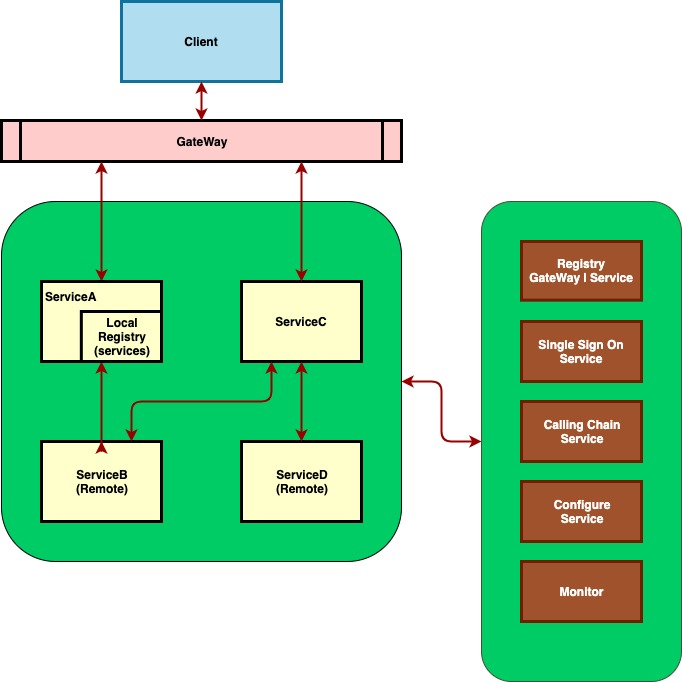

# trellis 

A micro service framework, which can build some services (component) into one server (like lego) 

## SOMETHING TODO

* caller: http | grpc ...
* regitry: dns | consul ...
* calling chain service.
* config service: such as: build、 run configures.
* monitor service: monitor logs, services' status, etc.
* checking services' registry in configure